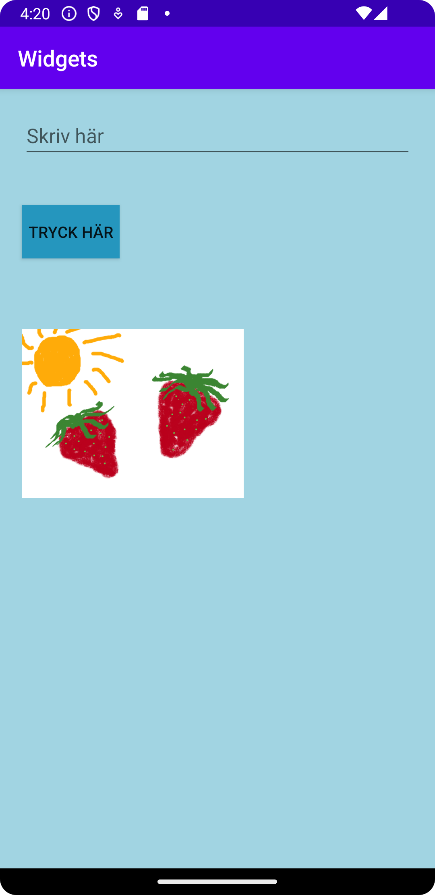

# Rapport

**Skriv din rapport här!**

Added LinearLayout inside constraintlayout in activity_main.xml. 
```
    <LinearLayout
        android:layout_width="match_parent"
        android:layout_height="match_parent"
        android:orientation="horizontal"
        android:background="#a1d4e2">

    </LinearLayout>
```
Added EditText with placeholder "Skriv här" in activity_main.xml
```
        <EditText
            android:id="@+id/myEdtText"
            android:hint="Skriv här"
            android:layout_width="match_parent"
            android:layout_height="wrap_content"
            android:inputType="text"
            android:autofillHints="text"
            android:layout_margin="20dp"/>
```

```
        <Button
            android:id="@+id/myFirstBtn"
            android:text="Tryck här"
            android:layout_width="wrap_content"
            android:layout_height="wrap_content"
            android:layout_margin="20dp"
            android:background="#2596be"/>
```      
Added png-file in resource manager and added ImageView and added image there.
```  
        <ImageView
            android:id="@+id/myImage"
            android:layout_width="200dp"
            android:layout_height="200dp"
            android:layout_margin="20dp"
            android:contentDescription="summer_img"
            app:srcCompat="@drawable/summerimg" />
```              
## Följande grundsyn gäller dugga-svar:

- Ett kortfattat svar är att föredra. Svar som är längre än en sida text (skärmdumpar och programkod exkluderat) är onödigt långt.
- Svaret skall ha minst en snutt programkod.
- Svaret skall inkludera en kort övergripande förklarande text som redogör för vad respektive snutt programkod gör eller som svarar på annan teorifråga.
- Svaret skall ha minst en skärmdump. Skärmdumpar skall illustrera exekvering av relevant programkod. Eventuell text i skärmdumpar måste vara läsbar.
- I de fall detta efterfrågas, dela upp delar av ditt svar i för- och nackdelar. Dina för- respektive nackdelar skall vara i form av punktlistor med kortare stycken (3-4 meningar).

Programkod ska se ut som exemplet nedan. Koden måste vara korrekt indenterad då den blir lättare att läsa vilket gör det lättare att hitta syntaktiska fel.

```
function errorCallback(error) {
    switch(error.code) {
        case error.PERMISSION_DENIED:
            // Geolocation API stöds inte, gör något
            break;
        case error.POSITION_UNAVAILABLE:
            // Misslyckat positionsanrop, gör något
            break;
        case error.UNKNOWN_ERROR:
            // Okänt fel, gör något
            break;
    }
}
```

Bilder läggs i samma mapp som markdown-filen.



Läs gärna:

- Boulos, M.N.K., Warren, J., Gong, J. & Yue, P. (2010) Web GIS in practice VIII: HTML5 and the canvas element for interactive online mapping. International journal of health geographics 9, 14. Shin, Y. &
- Wunsche, B.C. (2013) A smartphone-based golf simulation exercise game for supporting arthritis patients. 2013 28th International Conference of Image and Vision Computing New Zealand (IVCNZ), IEEE, pp. 459–464.
- Wohlin, C., Runeson, P., Höst, M., Ohlsson, M.C., Regnell, B., Wesslén, A. (2012) Experimentation in Software Engineering, Berlin, Heidelberg: Springer Berlin Heidelberg.
